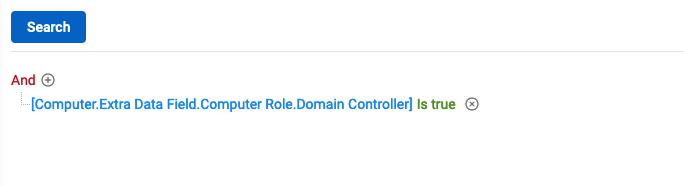
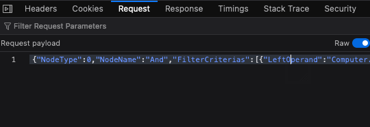
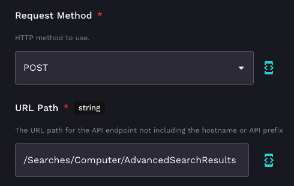
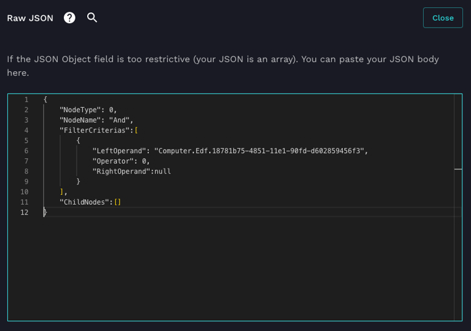
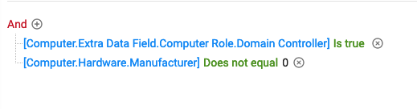

# Advanced ConnectWise Automate Searches

ConnectWise Automate has an undocumented API endpoint for performing Advanced Searches. This endpoint is super useful as it allows you to search and filter information quickly. It also allows you to search EDF's that aren't available in the ExtraFields endpoint.

The following example shows how to use Rewst to perform these advanced searches.

The first thing to do is to build the search in Automate web with all of the parameters you want. This makes building the search much easier, as you don't have to guess and build the search parameters, then troubleshoot when it doesn't work.

Once you've got the search built, open your browser development tools, go to the Network tab. Once you've got this up, go ahead and hit Search. You'll see the request to the API get sent. In the Request tab (or equivalent in your Browser Dev Tools), you'll see the JSON body that was sent in the request. Go ahead and copy this.

Now head on over to Rewst.

Grab yourself a CW Automate API Request generic action. Set the Request Method to POST and the URL to ***/Searches/Computer/AdvancedSearchResult*** (or ***/Searches/NetworkDevices/AdvancedSearchResult*** if you're searching for Network Devices).

For the Raw JSON, paste the JSON you copied from the browser dev tools.

Now once you run this you'll get a list of objects that match the search criteria. If the search result doesn't return any results, the list will contain one object that contains all of the expected attributes, but the values will all be null. You'll have to check for this condition in Jinja to see if there are true results or not.

If you haven't worked with Advanced Searches in Automate, here's a tip to help get more information from your searches. Using the example above, lets say we want to also get the manufacturer of the computer. What you want to do is add a condition to the search that will always be true. The example below adds the conditions that the Manufacturer does not equal 0. This ensures that the Manufacturer field will get returned.

