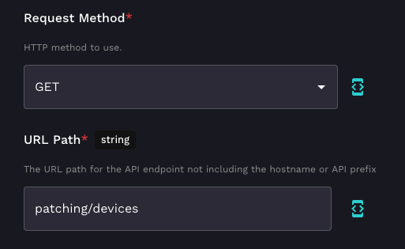
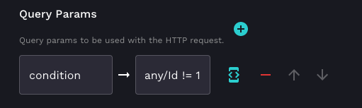
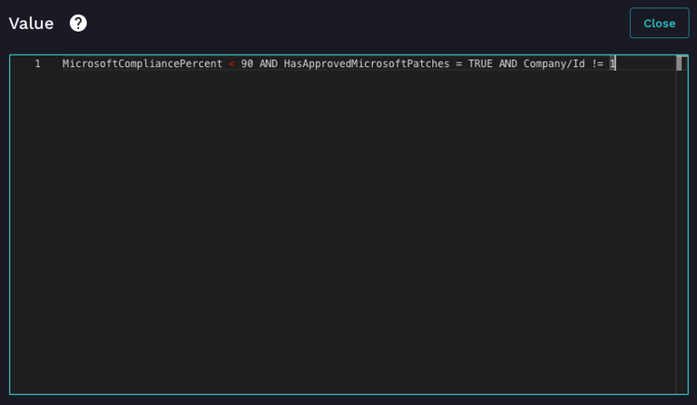
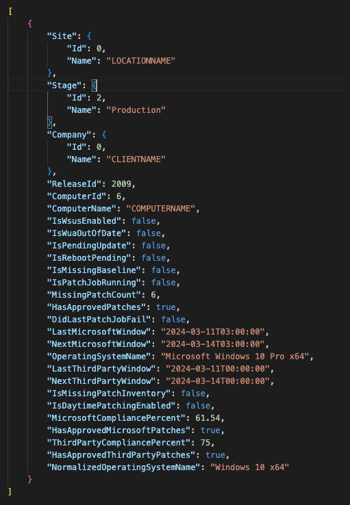

# Find ConnectWise Automate Patching Issues

If you're running ConnectWise Automate and using Rewst, you can easily query an API endpoint to get patching details so you can take action against devices with patching issues.

In Rewst, you're going to want to use a generic CW Automate API Request action, as there's no prebuilt action to grab this data. You'll want to perform a ***GET*** request with the URL Path of ***patching/devices***.

If you run this action now, you're going to get patching information for all devices in your Automate instance, so you'll want to filter this down to only get the items with issues. Let's say we want to only see devices where there are approved Microsoft patches, a Microsoft patch compliance score of less than 90%, and lets exclude the Automate default Company (ID 1). Add a Query Param called ***condition*** with the value of: ***MicrosoftCompliancePercent < 90 AND HasApprovedMicrosoftPatches = TRUE AND Company/Id != 1***

Now if you run this, you'll get machines with Microsoft patching issues. There are several other attributes you can filter on, including third party patching compliance. Below is an example of the return data, so you can know what to expect as a response and so you can build your own condition filter to fit your needs.

