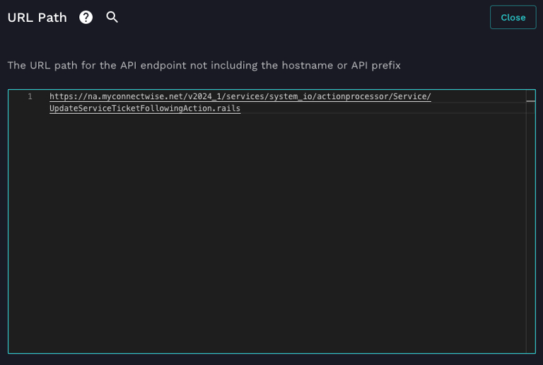
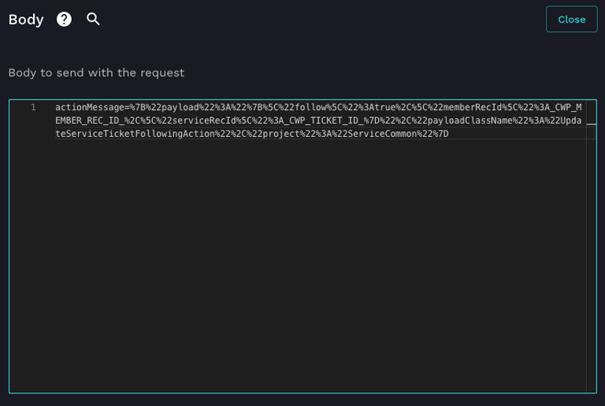
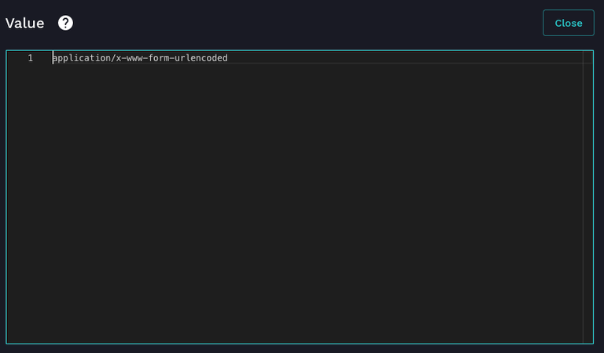
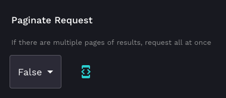
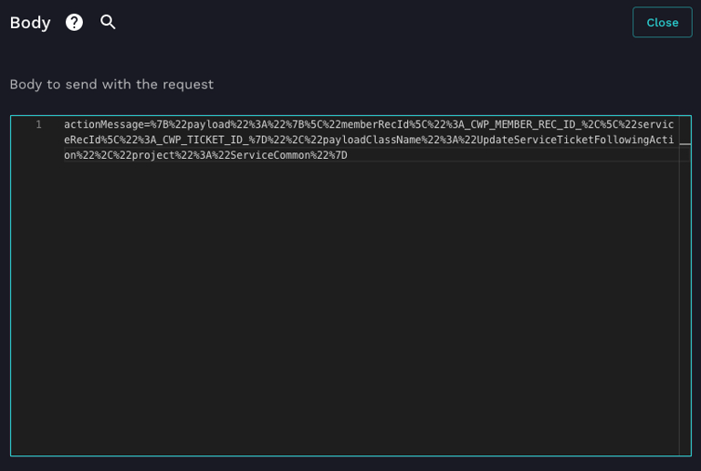

# Follow ConnectWise PSA Tickets

ConnectWise PSA has the ability for users to follow tickets, even if they aren't an assigned resource for the ticket. This functionality hasn't been brought to the REST API, it's only available in a legacy Rails endpoint. You can use Rewst to access this legacy endpoint and automate the following of tickets.

The first thing you want to do is grab a generic CW PSA API Request action. Set the Request Method to ***POST***.


For the URL path you're going to have to use the full URL for the endpoint, so use the following, substituting the domain and the API version with what is applicable to you: ***https://na.myconnectwise.net/v2024_1/services/system_io/actionprocessor/Service/UpdateServiceTicketFollowingAction.rails***



Now, set the body to the following replacing ***_CWP_MEMBER_REC_ID_*** and ***_CWP_TICKET_ID_*** with applicable values:

```
***actionMessage=%7B%22payload%22%3A%22%7B%5C%22follow%5C%22%3Atrue%2C%5C%22memberRecId%5C%22%3A_CWP_MEMBER_REC_ID_%2C%5C%22serviceRecId%5C%22%3A_CWP_TICKET_ID_%7D%22%2C%22payloadClassName%22%3A%22UpdateServiceTicketFollowingAction%22%2C%22project%22%3A%22ServiceCommon%22%7D***
```



Next, add a Header called ***Content-Type*** with a value of ***application/x-www-form-urlencoded***




Lastly, set ***Paginate Request*** to ***False***.



Once you run this request you'll get back an object like the following, if everything was successful:

```
{
    "success": true,
    "error": null,
    "data": {
        "isSuccess": true,
        "error": null,
        "action": {
            "serviceRecId": TICKET_ID,
            "memberRecId": MEMBER_REC_ID,
            "follow": true,
            "memberID": "MEMBER_ID",
            "companyName": "COMPANY_NAME"
        }
    }
}
```

If it doesn't work you'll either get indications in the object above that there was a failure or if the syntax of the request was incorrect you'll get a blank response back.

You can also use the same endpoint to unfollow a ticket. All you need to change is the body to the following, replacing ***_CWP_MEMBER_REC_ID_*** and ***_CWP_TICKET_ID_*** with applicable values:

```
***actionMessage=%7B%22payload%22%3A%22%7B%5C%22memberRecId%5C%22%3A_CWP_MEMBER_REC_ID_%2C%5C%22serviceRecId%5C%22%3A_CWP_TICKET_ID_%7D%22%2C%22payloadClassName%22%3A%22UpdateServiceTicketFollowingAction%22%2C%22project%22%3A%22ServiceCommon%22%7D***
```



Once you run this request you'll get back an object like the following, if everything was successful:

```
{
    "success": true,
    "error": null,
    "data": {
        "isSuccess": true,
        "error": null,
        "action": {
            "serviceRecId": TICKET_ID,
            "memberRecId": MEMBER_REC_ID,
            "follow": false,
            "memberID": "MEMBER_ID",
            "companyName": "COMPANY_NAME"
        }
    }
}
```

If it doesn't work you'll either get indications in the object above that there was a failure or if the syntax of the request was incorrect you'll get a blank response back.
