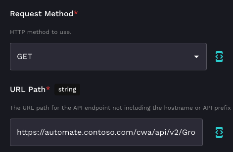
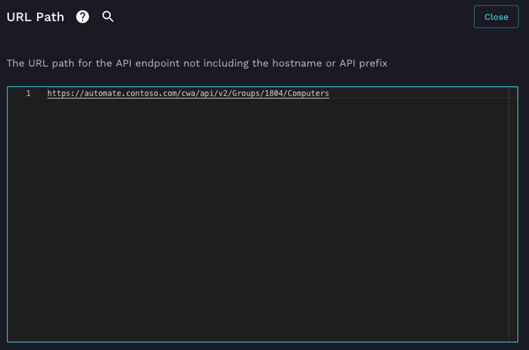
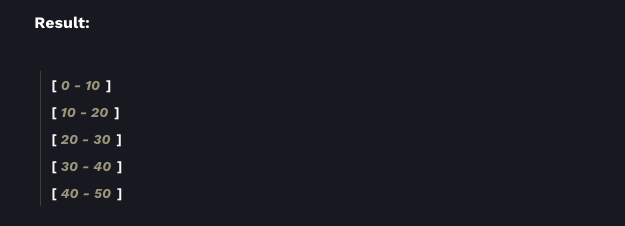

# Get ConnectWise Automate Group Memberships

ConnectWise has added V2 for some of their endpoints in Automate. One of those is the new V2 endpoint for getting groups, which allows you to get group memberships. This is super useful for getting a group of pre-filtered devices to perform actions against with Rewst. At the time of writing this, Rewst doesn't have an option to choose V2 endpoints, but if you use the whole URL in the URL Path field for the CW Automate API Request generic action, you can use these new endpoints.

The following example demonstrates how to get computer memberships to a group. You'll need the URL to your ConnectWise Automate instance, as well as a group ID. You can get a list of group ID's by running the built in Rewst action ***List Groups***.

Grab yourself a CW Automate API Request generic action. Set the Request Method to ***GET*** and the URL to ***https://YOUR_CWA_INSTANCE/cwa/api/v2/Groups/GROUP_ID/Computers***.





Running this action will now give you back a list of standard Automate Computer objects.



Below are a list of Groups V2 endpoints:

```
Group Configuration (Do not Paginate this one):
https://YOUR_CWA_INSTANCE/cwa/api/v2/Groups/GROUP_ID

Computers: 
https://YOUR_CWA_INSTANCE/cwa/api/v2/Groups/GROUP_ID/Computers

Network Devices:
https://YOUR_CWA_INSTANCE/cwa/api/v2/Groups/GROUP_ID/NetworkDevices

Contacts:
https://YOUR_CWA_INSTANCE/cwa/api/v2/Groups/GROUP_ID/Contacts

Scheduled Scripts:
https://YOUR_CWA_INSTANCE/cwa/api/v2/Groups/GROUP_ID/ScheduledScripts

Internal Monitors:
https://YOUR_CWA_INSTANCE/cwa/api/v2/Groups/GROUP_ID/InternalMonitors

Remote Monitors:
https://YOUR_CWA_INSTANCE/cwa/api/v2/Groups/GROUP_ID/RemoteMonitors
```
