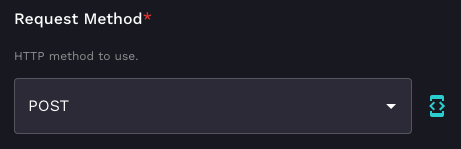
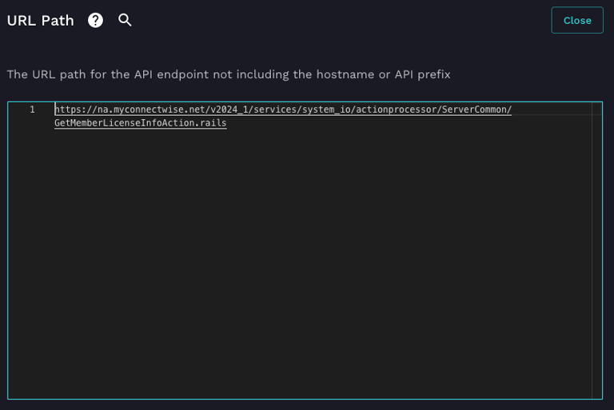
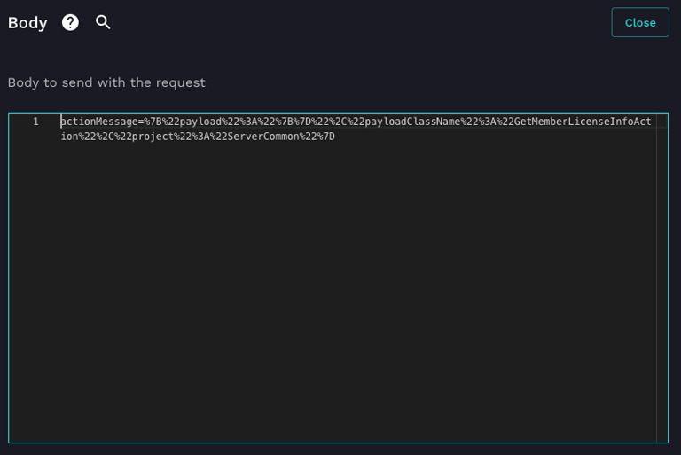
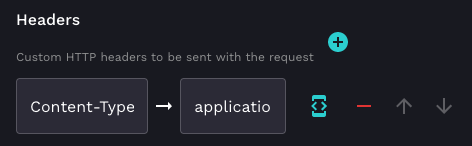
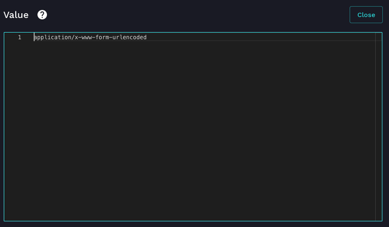

# Get ConnectWise PSA Licensing Info

ConnectWise PSA has a rather large REST API, however there are quite a few legacy Rails endpoints for things that weren't moved to REST and this includes getting the licensing information for your ConnectWise PSA instance. You can use Rewst to access these legacy Rails endpoints.

The first thing you want to do is grab a generic CW PSA API Request action. Set the Request Method to ***POST***. 



For the URL path you're going to have to use the full URL for the endpoint, so use the following, substituting the domain and the API version with what is applicable to you: ***https://na.myconnectwise.net/v2024_1/services/system_io/actionprocessor/ServerCommon/GetMemberLicenseInfoAction.rails***



Now, set the body to: ***actionMessage=%7B%22payload%22%3A%22%7B%7D%22%2C%22payloadClassName%22%3A%22GetMemberLicenseInfoAction%22%2C%22project%22%3A%22ServerCommon%22%7D***



Next, add a Header called ***Content-Type*** with a value of ***application/x-www-form-urlencoded***





Lastly, set the Paginate Request to ***False***


Once you run this request you'll get back an object like the following, if everything was successful:

```
{
  "data": {
    "error": null,
    "action": {
      "memberID": "MEMBER_ID",
      "companyName": "COMPANY_NAME",
      "memberLicenseInfo": {
        "activeMembers": 24,
        "licensedMembers": 25,
        "activeMembersFlex": 0,
        "activeMembersFull": 24,
        "activeMembersClient": 0,
        "mobileActiveMembers": 20,
        "mobileLicensedMembers": 25
      }
    },
    "isSuccess": true
  },
  "error": null,
  "success": true
}
```

If it doesn't work you'll either get indications in the object above that there was a failure or if the syntax of the request was incorrect you'll get a blank response back.
